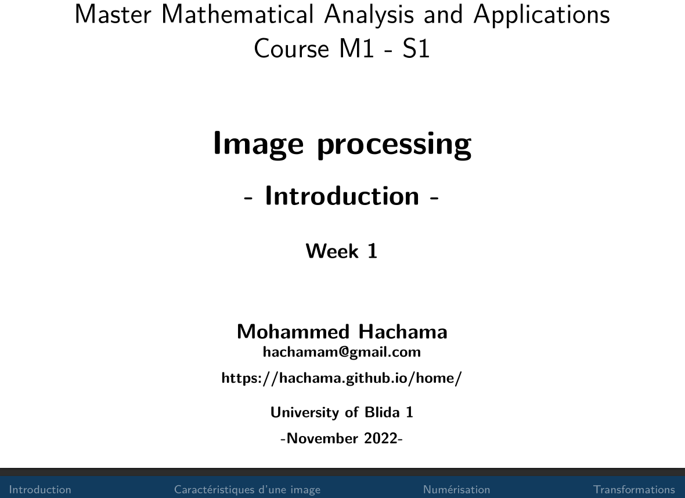

 

|---------+---------------------------------+--------------------------+---------------------------------+-------------------+-----------------------|
| Week    |          Chapter                | Slides/Scribes           | Assignemts/Projects             | Problem sets      |   Assignment Deadline |
|:-------:|:-------------------------------:|:------------------------:|:-------------------------------:|:-----------------:|:---------------------:|
|   1     |Introduction                     | [Slides 1](slides#intro) | [Assignment 1](tp/assign1.pdf)  | [PS 1](td/ps1.pdf)|  __October 8__        | 
|=========+=================================+==========================+=====================+===================+===================================|
|:-------:|:-------------------------------:|:------------------------:|:-------------------------------:|:-----------------:|:---------------------:|
|  2-3    | Spatial processing              | [Slides 2](slides#spat)  | [Assignment 2](tp/assign2.pdf)  | [PS 2](td/ps2.pdf)|  __October 27__       |
|:-------:|:-------------------------------:|:------------------------:|:-------------------------------:|:-----------------:|:---------------------:|
|  4-5    | Frequential processing          | [Slides 3](slides#frequ) | [Assignment 3](tp/assign3.pdf)  | [PS 3](td/ps3.pdf)|  __November 28__      |   
|:-------:|:-------------------------------:|:------------------------:|:-------------------------------:|:-----------------:|:---------------------:|
|  6      | Compressing                     |[Slides 4](slides#compress)| [Assignment 4](tp/assign4.pdf) |                   |                       |     
|:-------:|:-------------------------------:|:------------------------:|:-------------------------------:|:-----------------:|:---------------------:|
|  8-10   | Restoration                     |            -             |               -                 |        -          |            -          |
|:-------:|:-------------------------------:|:------------------------:|:-------------------------------:|:-----------------:|:---------------------:|
| 11-13   | Segmentation                    |            -             |               -                 |        -          |            -          |
|=========+=================================+==========================+=================================+===================+=======================|

<!--
|:-------:|:-------------------------------:|:------------------------:|:-------------------------------:|:-----------------:|:---------------------:|
|  4-5    | Frequential processing          | [Slides 3](slides#freq)  | [Assignment 3](tp/assign3.pdf)  | [PS 3](td/ps3.pdf)|                       |     
|:-------:|:-------------------------------:|:------------------------:|:-------------------------------:|:-----------------:|:---------------------:|
|  6      | Compressing                     | [Slides 4](slides#freq)  | [Assignment 4](tp/assign4.pdf)  | [PS 4](td/ps4.pdf)|                       |     
|:-------:|:-------------------------------:|:------------------------:|:-------------------------------:|:-----------------:|:---------------------:|
|  8-10   | Restoration                     | [Slides 5](slides#resto) | [[Assignment 5](tp/assign5.pdf) | [PS 5](td/ps5.pdf)|                       | 
|:-------:|:-------------------------------:|:------------------------:|:-------------------------------:|:-----------------:|:---------------------:|
| 11-13   | Segmentation                    | [Slides 6](slides#segm)  | [[Assignment 6](tp/assign6.pdf) | [PS 6](td/ps6.pdf)|                       | 
|=========+=================================+==========================+=================================+===================+=======================|
-->

[//]: <> (Video lectures)
[//]: <> ()
